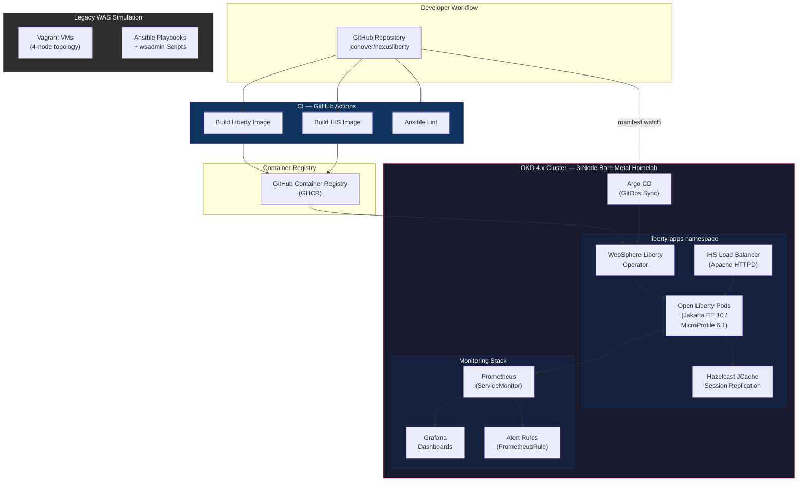

# NexusLiberty

[](https://github.com/jconover/nexusliberty/actions/workflows/liberty-build.yml)
[](https://github.com/jconover/nexusliberty/actions/workflows/ihs-build.yml)
[](https://github.com/jconover/nexusliberty/actions/workflows/ansible-lint.yml)

**Modernizing enterprise Java workloads from IBM WebSphere Application Server to containerized Open Liberty on Red Hat OpenShift** — with full CI/CD automation, GitOps delivery, session clustering, and observability baked in.

This portfolio project walks through the complete modernization lifecycle that enterprises face when moving off legacy WAS ND: automating the existing environment with Ansible, migrating to Liberty, containerizing workloads, deploying to OpenShift via operators, and running production-grade operations with monitoring and HA.

**Portfolio**: [devopsnexus.io](https://devopsnexus.io) | **GitHub**: [github.com/jconover/nexusliberty](https://github.com/jconover/nexusliberty)

---

## Table of Contents

- [Architecture](#architecture)
- [Infrastructure](#infrastructure)
- [Tech Stack](#tech-stack)
- [Project Phases](#project-phases)
- [Engineering Decisions](#engineering-decisions)
- [Quick Start](#quick-start)
- [Repository Structure](#repository-structure)
- [License](#license)

---

## Architecture



**CI path**: Code push triggers GitHub Actions, which builds Liberty and IHS container images and pushes them to GHCR. Argo CD on the OKD cluster watches the repository manifests and auto-syncs deployments.

**Legacy path**: Vagrant provisions a simulated 4-node WAS ND cell (Deployment Manager, two managed nodes, IHS). Ansible automates installation, clustering, app deployment, and health checks — demonstrating the "before" state that motivates the modernization.

---

## Infrastructure

This project runs on a real bare metal homelab cluster, not cloud VMs:

| Node | Hardware | Role |
|---|---|---|
| 3x Beelink SER5 Max | AMD Ryzen 7 6800U (8C/16T), 32GB LPDDR5, 1TB NVMe | OKD 4.x control plane + worker (converged) |

The 3-node cluster runs the full OKD platform with converged control plane and worker roles, supporting the Liberty Operator, Argo CD, Prometheus monitoring, and all workloads. See [Phase 1: OKD Cluster Setup](docs/phase1-liberty-operator-install.md) for installation details.

---

## Tech Stack

| Layer | Technology | Version |
|---|---|---|
| Container Platform | Red Hat OKD (OpenShift upstream) | 4.x |
| Middleware Runtime | Open Liberty | 24.x |
| Application | Jakarta EE / MicroProfile | EE 10 / MP 6.1 |
| Legacy Middleware | IBM WAS ND (simulated via Vagrant) | — |
| Session Clustering | Hazelcast JCache (embedded, K8s discovery) | 5.x |
| Automation | Ansible | 2.x |
| CI | GitHub Actions | — |
| CD / GitOps | OpenShift GitOps (Argo CD) | — |
| On-Cluster CI | Tekton / OpenShift Pipelines | — |
| Load Balancing | Apache HTTPD (IHS pattern, mod_proxy) | 2.4 |
| Monitoring | Prometheus + Grafana (ServiceMonitor + dashboards) | — |
| Containers | Docker / Podman | — |
| SCM | Git / GitHub | — |

---

## Project Phases

All five phases are complete. Each phase links to its detailed walkthrough documentation.

### Phase 1 — OKD Cluster Setup ✅

> [Phase 1 Walkthrough](docs/phase1-liberty-operator-install.md)

3-node bare metal OKD 4.x cluster installed via Assisted Installer. WebSphere Liberty Operator deployed and validated with a sample application end-to-end.

### Phase 2 — Liberty Containerization ✅

> [Phase 2 Walkthrough](docs/phase2-liberty-containerization.md)

Multi-stage Dockerfile builds a Jakarta EE 10 application on Open Liberty. Image pushed to GHCR, deployed via the Liberty Operator CR, and exposed through an OpenShift Route.

### Phase 3 — Ansible WAS Automation ✅

> [Phase 3 Walkthrough](docs/phase3-ansible-was-automation.md)

Vagrant provisions a 4-node WAS ND simulation (DMGR, two managed nodes, IHS). Ansible playbooks handle installation, cluster creation, application deployment, and IHS reverse proxy configuration. wsadmin Jython scripts automate common admin tasks.

### Phase 4 — CI/CD Pipeline ✅

> [Phase 4 Walkthrough](docs/phase4-cicd-argocd.md)

GitHub Actions provides pre-merge quality gates (Maven build, Dockerfile lint, Ansible lint). Tekton pipelines handle on-cluster builds. Argo CD watches the repository and auto-syncs deployments to OKD with self-heal enabled.

### Phase 5 — HA and Operations ✅

> [Phase 5 Walkthrough](docs/phase5-ha-operations.md)

Hazelcast JCache provides session replication across Liberty instances. IHS (Apache HTTPD) load balances traffic. Prometheus scrapes Liberty metrics via mpMetrics, Grafana visualizes JVM and request data, and PrometheusRules fire alerts on pod failures, high latency, and error rates.

---

## Engineering Decisions

Key technical choices and the reasoning behind them:

- **Open Liberty over IBM WAS Liberty** — Open Liberty is the upstream open-source runtime. No license fees, same enterprise features, and the Liberty Operator supports it natively. Ideal for a portfolio project that anyone can reproduce.

- **Hazelcast JCache for session replication** — Embedded Hazelcast with Kubernetes-native discovery (via the headless service and RBAC) provides session clustering without an external cache tier. Keeps the architecture simple while demonstrating real HA behavior.

- **Edge-terminated TLS Routes** — OpenShift Routes handle TLS termination at the edge rather than inside Liberty. This simplifies certificate management and aligns with how most enterprises deploy in production.

- **Umbrella Liberty features for development speed** — `server.xml` uses `webProfile-10.0` and `microProfile-6.1` umbrella features instead of cherry-picking individual specs. Faster iteration during development, with the option to trim for production.

- **Vagrant simulation boundary for WAS ND** — The legacy environment simulates WAS ND structure and automation patterns without requiring an IBM license. Ansible playbooks and wsadmin scripts are real; the WAS binaries are simulated. This demonstrates the automation skill without licensing constraints.

---

## Quick Start

```bash
# Build Liberty image locally
docker build -t nexusliberty-app:latest ./docker/liberty-app/

# Test locally
docker run -p 9080:9080 -p 9443:9443 nexusliberty-app:latest
# App available at http://localhost:9080/nexusapp/

# Deploy to OKD (Argo CD auto-syncs from this repo, or manually):
oc apply -f openshift/liberty-deployment/WebSphereLibertyApplication.yaml
```

> **Note**: The `oc` commands require access to an OKD/OpenShift cluster. See the [Phase 1 walkthrough](docs/phase1-liberty-operator-install.md) for cluster setup instructions.

---

## Repository Structure

```
nexusliberty/
├── app/                               # Jakarta EE application (Maven)
│   ├── pom.xml
│   └── src/main/
│       ├── java/io/devopsnexus/nexusapp/
│       │   ├── NexusApplication.java      # JAX-RS application root
│       │   ├── HealthResource.java        # /api/health endpoint
│       │   ├── InfoResource.java          # /api/info endpoint
│       │   ├── LivenessCheck.java         # MicroProfile liveness probe
│       │   └── ReadinessCheck.java        # MicroProfile readiness probe
│       └── webapp/index.html
│
├── docker/
│   ├── liberty-app/                       # Liberty container image
│   │   ├── Dockerfile                     # Multi-stage Maven build → Open Liberty
│   │   ├── server.xml                     # Liberty server config
│   │   └── hazelcast-client.xml           # Hazelcast K8s discovery config
│   └── ihs/                               # IHS (Apache HTTPD) load balancer
│       ├── Dockerfile
│       └── httpd.conf                     # Reverse proxy + load balancing
│
├── openshift/
│   ├── liberty-deployment/                # Liberty Operator CR + RBAC
│   │   ├── WebSphereLibertyApplication.yaml
│   │   ├── headless-service.yaml          # Hazelcast cluster discovery
│   │   └── rbac.yaml
│   ├── ihs-deployment/                    # IHS load balancer deployment
│   │   ├── deployment.yaml
│   │   ├── service.yaml
│   │   └── route.yaml
│   ├── monitoring/                        # Prometheus + Grafana
│   │   ├── servicemonitor.yaml
│   │   ├── prometheusrule.yaml
│   │   ├── grafana-dashboard.yaml
│   │   └── cluster-monitoring-config.yaml
│   └── pipelines/                         # Tekton CI pipeline
│       ├── 01-rbac.yaml
│       ├── 02-pvc.yaml
│       ├── 03-secrets.yaml.example
│       ├── 04-task-git-update-manifest.yaml
│       ├── 05-pipeline.yaml
│       └── 06-pipelinerun-template.yaml
│
├── cluster/                               # OKD cluster-level config
│   ├── namespace/
│   ├── operators/                         # Liberty Operator, Pipelines, Builds
│   ├── gitops/                            # Argo CD Application + RBAC
│   │   ├── argocd-nexusliberty-app.yaml
│   │   ├── argocd-rbac.yaml
│   │   └── openshift-gitops-subscription.yaml
│   └── oauth/
│
├── ansible/                               # WAS ND automation
│   ├── inventory/
│   │   ├── hosts.ini
│   │   └── group_vars/
│   ├── playbooks/
│   │   ├── was-install.yml
│   │   ├── was-cluster.yml
│   │   ├── ihs-install.yml
│   │   └── was-deploy-app.yml
│   └── roles/                             # was-base, was-dmgr, was-nodeagent,
│                                          # was-cluster, was-deploy, ihs-proxy
│
├── scripts/wsadmin/                       # wsadmin Jython admin scripts
├── vagrant/                               # WAS ND on-prem simulation (4-node)
│   ├── Vagrantfile
│   └── provision/
│
├── docs/                                  # Phase walkthroughs and runbooks
│   ├── phase1-liberty-operator-install.md
│   ├── phase2-liberty-containerization.md
│   ├── phase3-ansible-was-automation.md
│   ├── phase4-cicd-argocd.md
│   ├── phase5-ha-operations.md
│   └── was-runbook.md
│
└── .github/workflows/                     # CI pipelines
    ├── liberty-build.yml
    ├── ihs-build.yml
    └── ansible-lint.yml
```

---

## License

This project is licensed under the [MIT License](LICENSE).
