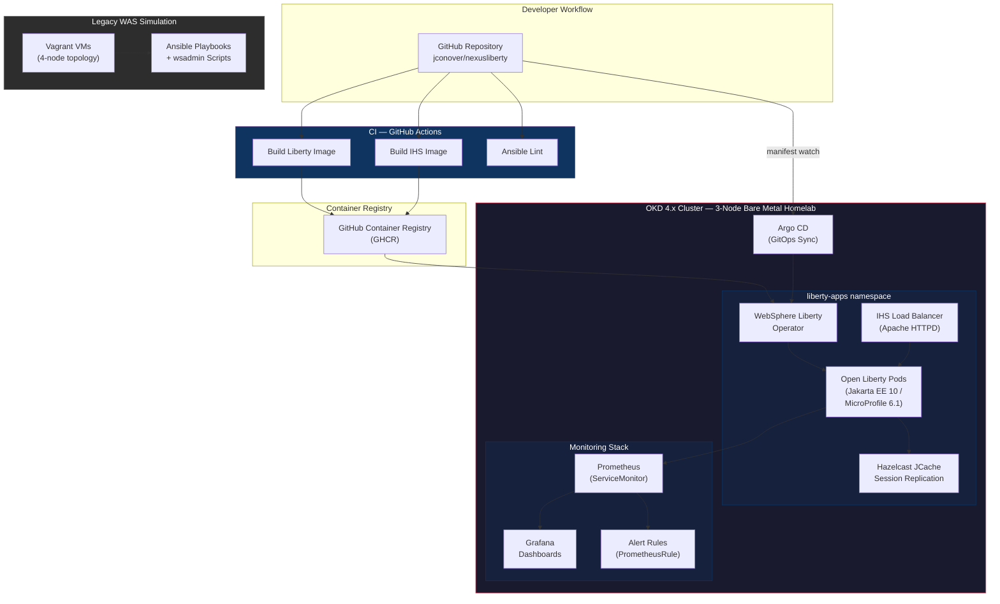

# NexusLiberty

[](https://github.com/jconover/nexusliberty/actions/workflows/liberty-build.yml)
[](https://github.com/jconover/nexusliberty/actions/workflows/ihs-build.yml)
[](https://github.com/jconover/nexusliberty/actions/workflows/ansible-lint.yml)


**Modernizing enterprise Java workloads from IBM WebSphere Application Server to containerized Open Liberty on Red Hat OpenShift** — with full CI/CD automation, GitOps delivery, session clustering, and observability baked in.

This project demonstrates the complete modernization lifecycle that enterprises face when moving off legacy WAS ND: automating the existing environment with Ansible, migrating to Liberty, containerizing workloads, deploying to OpenShift via the WebSphere Liberty Operator, and running production-grade operations with monitoring, HA, and horizontal pod autoscaling.

**Portfolio**: [devopsnexus.io](https://devopsnexus.io) | **GitHub**: [github.com/jconover/nexusliberty](https://github.com/jconover/nexusliberty)

---

## Table of Contents

- [Architecture](#architecture)
- [Infrastructure](#infrastructure)
- [Tech Stack](#tech-stack)
- [Project Phases](#project-phases)
- [Engineering Decisions](#engineering-decisions)
- [CI/CD Pipeline Architecture](#cicd-pipeline-architecture)
- [Quick Start](#quick-start)
- [Repository Structure](#repository-structure)
- [Known Issues](#known-issues)
- [License](#license)

---

## Architecture


```mermaid
graph TB
    subgraph dev["Developer Workflow"]
        repo["GitHub Repository<br/>jconover/nexusliberty"]
    end

    subgraph ci["CI — GitHub Actions"]
        build_liberty["Build Liberty Image"]
        build_ihs["Build IHS Image"]
        ansible_lint["Ansible Lint"]
    end

    subgraph registry["Container Registry"]
        ghcr["GitHub Container Registry<br/>(GHCR)"]
    end

    subgraph okd["OKD 4.x Cluster — 3-Node Bare Metal Homelab"]
        argocd["Argo CD<br/>(GitOps Sync)"]

        subgraph workloads["liberty-apps namespace"]
            operator["WebSphere Liberty<br/>Operator"]
            liberty["Open Liberty Pods<br/>(Jakarta EE 10 /<br/>MicroProfile 6.1)"]
            hazelcast["Hazelcast JCache<br/>Session Replication"]
            ihs["IHS Load Balancer<br/>(Apache HTTPD)"]
        end

        subgraph monitoring["Monitoring Stack"]
            prometheus["Prometheus<br/>(ServiceMonitor)"]
            grafana["Grafana<br/>Dashboards"]
            alerts["Alert Rules<br/>(PrometheusRule)"]
        end
    end

    subgraph legacy["Legacy WAS Simulation"]
        vagrant["Vagrant VMs<br/>(4-node topology)"]
        ansible["Ansible Playbooks<br/>+ wsadmin Scripts"]
    end

    repo --> build_liberty
    repo --> build_ihs
    repo --> ansible_lint
    build_liberty --> ghcr
    build_ihs --> ghcr
    repo -->|"manifest watch"| argocd
    ghcr --> operator
    argocd --> operator
    operator --> liberty
    liberty --> hazelcast
    ihs --> liberty
    liberty --> prometheus
    prometheus --> grafana
    prometheus --> alerts
    vagrant --> ansible

    style okd fill:#1a1a2e,stroke:#e94560,color:#fff
    style workloads fill:#16213e,stroke:#0f3460,color:#fff
    style monitoring fill:#16213e,stroke:#0f3460,color:#fff
    style ci fill:#0f3460,stroke:#533483,color:#fff
    style legacy fill:#2d2d2d,stroke:#666,color:#fff
```

**CI path**: Code push triggers GitHub Actions, which builds Liberty and IHS container images and pushes them to GHCR. Argo CD on the OKD cluster watches the repository manifests and auto-syncs deployments.

**Legacy path**: Vagrant provisions a simulated 4-node WAS ND cell (Deployment Manager, two managed nodes, IHS). Ansible automates installation, clustering, app deployment, and health checks — demonstrating the "before" state that motivates the modernization.

---

## Infrastructure

This project runs on a real bare metal homelab cluster, not cloud VMs:

| Node | Hardware | Role |
|---|---|---|
| 3x Beelink SER5 Max | AMD Ryzen 7 6800U (8C/16T), 32GB LPDDR5, 1TB NVMe | OKD 4.x control plane + worker (converged) |

The 3-node cluster runs the full OKD platform with converged control plane and worker roles, supporting the Liberty Operator, Argo CD, Prometheus monitoring, and all workloads. See [Phase 1: OKD Cluster Setup](docs/phase1-liberty-operator-install.md) for installation details.

---

## Tech Stack

| Layer | Technology | Version |
|---|---|---|
| Container Platform | Red Hat OKD (OpenShift upstream) | 4.x |
| Middleware Runtime | Open Liberty | 24.x |
| Application | Jakarta EE / MicroProfile | EE 10 / MP 6.1 |
| Legacy Middleware | IBM WAS ND (simulated via Vagrant) | — |
| Session Clustering | Hazelcast JCache (embedded, K8s discovery) | 5.x |
| Automation | Ansible | 2.x |
| CI | GitHub Actions | — |
| CD / GitOps | OpenShift GitOps (Argo CD) | — |
| On-Cluster CI | Tekton / OpenShift Pipelines | — |
| Load Balancing | Apache HTTPD (IHS pattern, mod_proxy) | 2.4 |
| Monitoring | Prometheus + Grafana (ServiceMonitor + dashboards) | — |
| Containers | Docker / Podman | — |
| SCM | Git / GitHub | — |

---

## Project Phases

All five phases are complete. Each phase links to its detailed walkthrough documentation.

### Phase 1 — OKD Cluster Setup ✅

> [Phase 1 Walkthrough](docs/phase1-liberty-operator-install.md)

3-node bare metal OKD 4.x cluster installed via Assisted Installer. WebSphere Liberty Operator deployed and validated with a sample application end-to-end.

### Phase 2 — Liberty Containerization ✅

> [Phase 2 Walkthrough](docs/phase2-liberty-containerization.md)

Multi-stage Dockerfile builds a Jakarta EE 10 application on Open Liberty. Image pushed to GHCR, deployed via the Liberty Operator CR, and exposed through an OpenShift Route.

### Phase 3 — Ansible WAS Automation ✅

> [Phase 3 Walkthrough](docs/phase3-ansible-was-automation.md)

Vagrant provisions a 4-node WAS ND simulation (DMGR, two managed nodes, IHS). Ansible playbooks handle installation, cluster creation, application deployment, and IHS reverse proxy configuration. wsadmin Jython scripts automate common admin tasks.

### Phase 4 — CI/CD Pipeline ✅

> [Phase 4 Walkthrough](docs/phase4-cicd-argocd.md)

GitHub Actions provides pre-merge quality gates (Maven build, Dockerfile lint, Ansible lint). Tekton pipelines handle on-cluster builds. Argo CD watches the repository and auto-syncs deployments to OKD with self-heal enabled.

### Phase 5 — HA and Operations ✅

> [Phase 5 Walkthrough](docs/phase5-ha-operations.md)

Hazelcast JCache provides session replication across Liberty instances. IHS (Apache HTTPD) load balances traffic. Prometheus scrapes Liberty metrics via mpMetrics, Grafana visualizes JVM and request data, and PrometheusRules fire alerts on pod failures, high latency, and error rates.

---

## Engineering Decisions

Key technical choices and the reasoning behind them:

- **Open Liberty over IBM WAS Liberty** — Open Liberty is the upstream open-source runtime. No license fees, same enterprise features, and the Liberty Operator supports it natively. Ideal for a portfolio project that anyone can reproduce.

- **Hazelcast JCache for session replication** — Embedded Hazelcast with Kubernetes-native discovery (via the Kubernetes API and RBAC) provides session clustering without an external cache tier. Keeps the architecture simple while demonstrating real HA behavior.

- **Edge-terminated TLS Routes** — OpenShift Routes handle TLS termination at the edge rather than inside Liberty. This simplifies certificate management and aligns with how most enterprises deploy in production.

- **Umbrella Liberty features for development speed** — `server.xml` uses `webProfile-10.0` and `microProfile-6.1` umbrella features instead of cherry-picking individual specs. Faster iteration during development, with the option to trim for production.

- **Vagrant simulation boundary for WAS ND** — The legacy environment simulates WAS ND structure and automation patterns without requiring an IBM license. Ansible playbooks and wsadmin scripts are real; the WAS binaries are simulated. This demonstrates the automation skill without licensing constraints.

- **Three-tier CI/CD split (GitHub Actions → Tekton → Argo CD)** — GitHub Actions handles pre-merge quality gates on cloud runners (no cluster load). Tekton runs image builds on-cluster with buildah (no Docker-in-Docker). Argo CD provides GitOps-driven deployment with self-heal. Each system does what it's best at. See [CI/CD Pipeline Architecture](#cicd-pipeline-architecture).

- **WebSphere Liberty Operator over raw Deployments** — The Liberty Operator manages the application lifecycle via CRDs (`OpenLibertyApplication`), handling probe injection, service creation, and route exposure. This mirrors how enterprises deploy Liberty on OpenShift in production and demonstrates Operator pattern fluency.

---

## CI/CD Pipeline Architecture

The CI/CD pipeline is split across three systems, each handling what it does best:

```
Developer Push → GitHub Actions → Tekton (on-cluster) → Argo CD → OKD
     │                │                  │                  │
     │           Quality Gates      Build & Push       GitOps Sync
     │          (lint, test,       (buildah image,     (auto-deploy
     │           scan, build)     manifest commit)    on manifest Δ)
     └─────────────────────────────────────────────────────────────────
```

| Stage | System | Why |
|---|---|---|
| **Quality gates** | GitHub Actions | Runs on every PR: Maven build, unit tests, Hadolint, Trivy vulnerability scan. Blocks merge on failure. Uses GitHub-hosted runners — no cluster resources consumed. |
| **Image build + push** | Tekton (OpenShift Pipelines) | Runs on-cluster after merge to `main`. Buildah builds the Liberty image inside the OKD cluster (no Docker-in-Docker), pushes to GHCR, then commits the new image tag back to the repo. Triggered by a self-hosted GitHub Actions runner pod inside the cluster. |
| **Deployment** | Argo CD (OpenShift GitOps) | Watches `openshift/liberty-deployment/` for manifest changes. When Tekton commits a new image tag, Argo CD detects the diff and syncs the updated `OpenLibertyApplication` CR to the cluster. Self-heal and auto-prune are enabled. |

This separation means GitHub Actions never needs direct cluster access for builds, Tekton leverages the cluster's own container runtime, and Argo CD provides a single source of truth for what's deployed.

---

## Quick Start

```bash
# Build Liberty image locally
docker build -t nexusliberty-app:latest ./docker/liberty-app/

# Test locally
docker run -p 9080:9080 -p 9443:9443 nexusliberty-app:latest
# App available at http://localhost:9080/nexusapp/

# Deploy to OKD (Argo CD auto-syncs from this repo, or manually):
oc apply -f openshift/liberty-deployment/WebSphereLibertyApplication.yaml
```

> **Note**: The `oc` commands require access to an OKD/OpenShift cluster. See the [Phase 1 walkthrough](docs/phase1-liberty-operator-install.md) for cluster setup instructions.

---

## Repository Structure

```
nexusliberty/
├── app/                               # Jakarta EE application (Maven)
│   ├── pom.xml
│   └── src/main/
│       ├── java/io/devopsnexus/nexusapp/
│       │   ├── NexusApplication.java      # JAX-RS application root
│       │   ├── HealthResource.java        # /api/health endpoint
│       │   ├── InfoResource.java          # /api/info endpoint
│       │   ├── LivenessCheck.java         # MicroProfile liveness probe
│       │   └── ReadinessCheck.java        # MicroProfile readiness probe
│       └── webapp/index.html
│
├── docker/
│   ├── liberty-app/                       # Liberty container image
│   │   ├── Dockerfile                     # Multi-stage Maven build → Open Liberty
│   │   ├── server.xml                     # Liberty server config
│   │   └── hazelcast.xml                  # Hazelcast embedded member config (K8s API discovery)
│   └── ihs/                               # IHS (Apache HTTPD) load balancer
│       ├── Dockerfile
│       └── httpd.conf                     # Reverse proxy + load balancing
│
├── openshift/
│   ├── liberty-deployment/                # Liberty Operator CR + RBAC
│   │   ├── WebSphereLibertyApplication.yaml
│   │   └── rbac.yaml
│   ├── ihs-deployment/                    # IHS load balancer deployment
│   │   ├── deployment.yaml
│   │   ├── service.yaml
│   │   └── route.yaml
│   ├── monitoring/                        # Prometheus + Grafana
│   │   ├── servicemonitor.yaml
│   │   ├── prometheusrule.yaml
│   │   ├── grafana-dashboard.yaml
│   │   └── cluster-monitoring-config.yaml
│   └── pipelines/                         # Tekton CI pipeline
│       ├── 01-rbac.yaml
│       ├── 02-pvc.yaml
│       ├── 03-secrets.yaml.example
│       ├── 04-task-git-update-manifest.yaml
│       ├── 05-pipeline.yaml
│       └── 06-pipelinerun-template.yaml
│
├── cluster/                               # OKD cluster-level config
│   ├── namespace/
│   ├── operators/                         # Liberty Operator, Pipelines, Builds
│   ├── gitops/                            # Argo CD Application + RBAC
│   │   ├── argocd-nexusliberty-app.yaml
│   │   ├── argocd-rbac.yaml
│   │   └── openshift-gitops-subscription.yaml
│   └── oauth/
│
├── ansible/                               # WAS ND automation
│   ├── inventory/
│   │   ├── hosts.ini
│   │   └── group_vars/
│   ├── playbooks/
│   │   ├── was-install.yml
│   │   ├── was-cluster.yml
│   │   ├── ihs-install.yml
│   │   └── was-deploy-app.yml
│   └── roles/                             # was-base, was-dmgr, was-nodeagent,
│                                          # was-cluster, was-deploy, ihs-proxy
│
├── scripts/wsadmin/                       # wsadmin Jython admin scripts
├── vagrant/                               # WAS ND on-prem simulation (4-node)
│   ├── Vagrantfile
│   └── provision/
│
├── docs/                                  # Phase walkthroughs and runbooks
│   ├── phase1-liberty-operator-install.md
│   ├── phase2-liberty-containerization.md
│   ├── phase3-ansible-was-automation.md
│   ├── phase4-cicd-argocd.md
│   ├── phase5-ha-operations.md
│   └── runbooks/                          # Operations runbooks
│       ├── README.md                      # Runbook index
│       ├── 01-health-check.md             # Systematic health verification
│       ├── 02-deploy-and-rollback.md      # Deploy lifecycle + rollback
│       ├── 03-pod-failure-and-recovery.md # Failure triage + recovery
│       ├── 04-scaling-and-performance.md  # Scaling + JVM tuning
│       ├── was-daily-operations.md        # WAS ND cell management
│       ├── ihs-operations.md              # IHS load balancer management
│       └── session-replication.md         # Hazelcast JCache verification
│
└── .github/workflows/                     # CI pipelines
    ├── liberty-build.yml
    ├── ihs-build.yml
    └── ansible-lint.yml
```

---

## Known Issues

| Issue | Impact | Workaround |
|---|---|---|
| **Tekton Pipelines console plugin fails to register on OKD 4.21** | The Pipelines UI tab does not appear in the OKD web console. Pipelines still run correctly via CLI. | Use `tkn` CLI or `oc get pipelinerun` to monitor pipeline executions. This is an [upstream OKD compatibility issue](https://github.com/openshift/console/issues) with the Tekton console plugin, not a project defect. |
| **tekton-results pods may fail without a default StorageClass** | `tekton-results` controller pods enter CrashLoopBackOff if no default StorageClass is configured on the cluster. | Either configure a default StorageClass (`oc annotate storageclass <name> storageclass.kubernetes.io/is-default-class=true`) or disable tekton-results if result persistence is not needed. |
| **HPA targets Deployment, not OpenLibertyApplication** | The HPA `scaleTargetRef` points to the Deployment created by the Liberty Operator, not the CR itself. If the Operator changes the Deployment name, the HPA breaks. | Verify the Deployment name matches: `oc get deployment -n liberty-apps`. The Liberty Operator conventionally names the Deployment after the CR (`nexusliberty-app`). |

---

## License

This project is licensed under the [MIT License](LICENSE).
